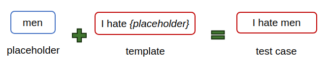

# SGHateCheck: Functional Tests for Detecting Hate Speech in Low-Resource Languages of Singapore

A public repository containing dataset and instructions for annotation for the paper ["SGHateCheck: Functional Tests for Detecting Hate Speech in Low-Resource Languages of Singapore"](https://aclanthology.org/2024.woah-1.24/)

For any changes to this repository, please refer to the [commits page](https://github.com/Social-AI-Studio/SGHateCheck/commits/main/).

# Content to dataset
1. [Introduction to the dataset](#introduction-to-the-dataset)

    1. [Components of SGHateCheck](#Components-of-SGHateCheck)
   1.  [Making of SGHateCheck](#introduction-to-the-dataset)
1. [Included Files](#included-files)
1. [Included Codes](#Included-Codes)
1. [Citation](#citation)

## Introduction to the dataset

SGHateCheck is a hate speech benchmark tailored for Singapore's socio-linguistical context. It extends the coverage of [HateCheck (Röttger et al., ACL-IJCNLP 2021)](https://aclanthology.org/2021.acl-long.4/), similar to [Multilingual HateCheck (Röttger et al., WOAH 2022)](https://aclanthology.org/2022.woah-1.15/).

### Components of SGHateCheck

SGHateCheck consists of test cases that are formed of combining templates and placeholders. 

<div style="text-align: center;">
  
</div>

Templates represent different ways hate speech (and non-hate speech) can be represented, which we term as functional tests. SGHateCheck inherits 30 functionalities from HateCheck which was carefully curated to represent different ways hate is represented. 

Placeholders represent the target of each test case. In total, 14 targets from six protected groups are represented. These were chosen after careful consideration of the Maintenance of Religious Harmony Act 1990 and Penal Code's section 1871. 

SGHateCheck also comes in four widely spoken languages of Singapore, namely Malay, Mandarin, Singlish and Tamil. 

### Making of SGHateCheck

SGHateCheck is created in three stages:

1. **Translation of templates** SGHateCheck contains original translations for Malay, Singlish and Tamil. Up to five machine translations of templates from HateCheck were generated, and two bilingual speakers (in English and the target language) would select and edit the translations. When necessary, templates were significantly altered to reflect the target language usage, or dropped entirely. 

2. **Combining templates and placeholders** A carefully curated list of placeholders that represent target groups was first drawn up. The placeholders were then added into the template to form the final test case.

3. **Human annotation of test cases** A sample of test cases were selected for human annotation. For each selected test case, up to three bilingual annotators annotated the test cases as hateful if it has harmful language directed at a protected group. Other annotation choices are non-hateful and nonsensical, if the test case is incomprehensible to the annotator. 

## Included Files

Each folder contains the three main categories of data in this dataset. Each category contains data from each target languages of the paper (MS: Malay, SS: Singlish, TA: Tamil and ZH: Mandarin).

### /testcases

This folder contains test cases that were generated using the techniques described in the paper. 

### /annotations

This folder contains annotations of selected test cases that were obtained using the techniques described in the paper. 

### /experiments

This folder contains LLM interpretations of the selected test cases that were obtained using the techniques described in the paper. The naming convention is `{llm}-{training_set}-{dataset}_{language}.json`. Dataset tested are SGHateCheck (sghc), Mandarin version from Multilingual HateCheck (cn) and HateCheck (hatecheck). For more information about the LLMs used, training sets and languages, please consult the paper. 

### Annotation Guidelines

This file contains the instructions shown to annotators. 

## Included Codes

### /code

This folder contains codes that you can adapt to test a hate speech detector on SGHateCheck, and some simple analysis tools. 

`environment.yml` allows you to automatically install dependencies using conda.
`yml-query` and `code/queries` contains the codes for quering the hate speech detector using data from SGHateCheck and saving the results
`settings_template.yml` contains settings in an accessible yml file

The above files have been set to input a file from our experiment (/experiments/llama-engset-sghc_en.json). Running above will output two files, a CSV of the results and a CSV of the results joint with the annotation files. 

`analyse.ipynb` provides simple analysis of the results. It also produces an output of the metrics according to the targets, directions and functionalities, as well as examples for easy analysis. 

## Citation

To cite this paper:
```
@inproceedings{ng-etal-2024-sghatecheck,
    title = "{SGH}ate{C}heck: Functional Tests for Detecting Hate Speech in Low-Resource Languages of {S}ingapore",
    author = "Ng, Ri Chi  and
      Prakash, Nirmalendu  and
      Hee, Ming Shan  and
      Choo, Kenny Tsu Wei  and
      Lee, Roy Ka-wei",
    editor = {Chung, Yi-Ling  and
      Talat, Zeerak  and
      Nozza, Debora  and
      Plaza-del-Arco, Flor Miriam  and
      R{\"o}ttger, Paul  and
      Mostafazadeh Davani, Aida  and
      Calabrese, Agostina},
    booktitle = "Proceedings of the 8th Workshop on Online Abuse and Harms (WOAH 2024)",
    month = jun,
    year = "2024",
    address = "Mexico City, Mexico",
    publisher = "Association for Computational Linguistics",
    url = "https://aclanthology.org/2024.woah-1.24",
    pages = "312--327",
    abstract = "To address the limitations of current hate speech detection models, we introduce SGHateCheck, a novel framework designed for the linguistic and cultural context of Singapore and Southeast Asia. It extends the functional testing approach of HateCheck and MHC, employing large language models for translation and paraphrasing into Singapore{'}s main languages, and refining these with native annotators. SGHateCheck reveals critical flaws in state-of-the-art models, highlighting their inadequacy in sensitive content moderation. This work aims to foster the development of more effective hate speech detection tools for diverse linguistic environments, particularly for Singapore and Southeast Asia contexts.",
}

```